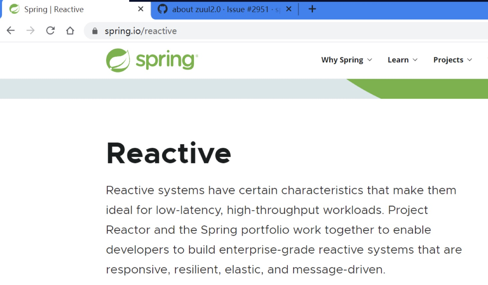
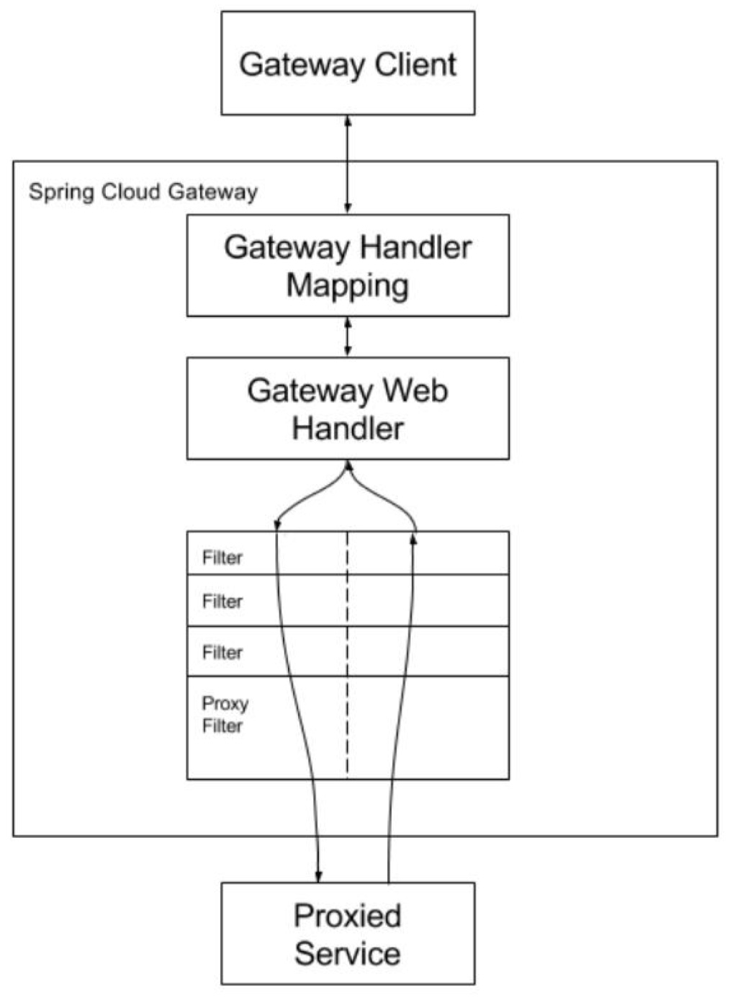

# 微服务网关

网关是系统唯一对外的入口，介于客户端与服务器端之间，用于对请求进行鉴权、限流、 路由、监控等功能。

### Spring Cloud Gateway

Spring Cloud Gateway 是 Spring Cloud 自己开发的开源 API 网关，建立在 Spring5，Reactor 和 Spring Boot 2 之上，使用非阻塞 API，支持异步开发。是 Zuul 网关的替代者。


### WebFlux 编程基础

Spring Cloud Gateway 无论是我们自己写代码，还是其框架源码，都是基于 WebFlux 进 行开发的。所以我们在学习 Spring Cloud Gateway 之前就需要先搞清楚这些概念。

#### Reactor、Reactive 及 WebFlux 间的关系


#### Reactor

Reactor 是一种完全基于 Reactive Streams 规范的、全新的库。


#### Reactive Streams

Reactive Streams 是 Reactive Programming 编程范式的 Java 规范，定义了 Reactive Programming 具体相关接口。


#### Reactive Programming

Reactive Programming 是一种新的编程范式、编程思想。其不同于我们传统的开发范式。 简单来说，其是一种基于流的开发模式。其就是一种编程思想，不是具体实现。


#### RxJava

RxJava 也是一套 Reactive Streams 规范库。其是 Reactive Streams 规范的基础，产生于 Reactive Streams 规范之前。RxJava 并不好用。 

Reactive Extensions(Rx)，原来是 .Net 平台上基于 Reactive Programming 的规范。


#### RxJava2

RxJava2 是 Reactive Streams 规范生成之后产生的，是基于 Reactive Streams 规范的，但 同时为了兼容 RxJava，其又改变了原来 Reactive Streams 的一些内容，导致 RxJava2 仍然很不 好用。


#### Reactive




#### WebFlux

Spring WebFlux 是一个使用 Reactive 技术栈构建出的框架。


#### Flux 与 Mono

Flux：一个包含了 0 个或多个元素的异步序列。简单理解为一个集合

Mono：一个包含了 0 个或 1 个元素的异步序列。简单理解为一个对象

简单来说，Reactive Streams 规范就是对这个异步序列中的元素进行处理的。


### Gateway 工作原理

#### 重要概念

在 Spring Cloud Gateway 中有三个非常重要的概念：

##### route 路由：

路由是网关的最基本组成，由一个路由 id、一个目标地址 url，一组断言工厂及一组 filter 组成。若断言为 true，则请求将经由 filter 被路由到目标 url。


##### predicate 断言：

断言即一个条件判断，根据当前的 http 请求进行指定规则的匹配，比如说 http 请求头， 请求时间等。只有当匹配上规则时，断言才为 true，此时请求才会被直接路由到目标地址（目 标服务器），或先路由到某过滤器链，经过过程器链的层层处理后，再路由到相应的目标地 址（目标服务器）。


##### filter 过滤器：

对请求进行处理的逻辑部分。当请求的断言为 true 时，会被路由到设置好的过滤器， 以对请求或响应进行处理。例如，可以为请求添加一个请求参数，或对请求 URI 进行修改， 或为响应添加 header 等。总之，就是对请求或响应进行处理。


#### 工作过程




#### Gateway 源码解析

```java
// spring-webflux-5.2.8.RELEASE DispatcherHandler
public Mono<Void> handle(ServerWebExchange exchange) {
    if (this.handlerMappings == null) {
        return createNotFoundError();
    }
    
    // 将一个集合构建为一个 Flux，Flux 是一个包含了 0 个或多个元素的异步序列，可简单理解为一个集合。
    return Flux.fromIterable(this.handlerMappings)
        // 将 Flux 中的元素由 mapping 转换为 Handler，即找到处理器
        .concatMap(mapping -> mapping.getHandler(exchange))
        // 从 Flux 中取出一个元素，其返回值为 Mono<Handler>
        .next()
        // 若当前这个 Mono 中包含的元素为空，则将 createNotFoundError() 的返回值作为元素，即使用 Exception 创建一个 Mono，相当于抛异常
        .switchIfEmpty(createNotFoundError())
        // 使用 Mono 中的元素 handler 作为参数，执行 invokeHandler() 方法，返回结果 Mono<HandlerResult>
        .flatMap(handler -> invokeHandler(exchange, handler))
        // 使用 Mono 中的元素 result 作为参数，执行 handleResult() 方法，返回结果 Mono<Void>，即没有返回值。
        .flatMap(result -> handleResult(exchange, result));
}
```
